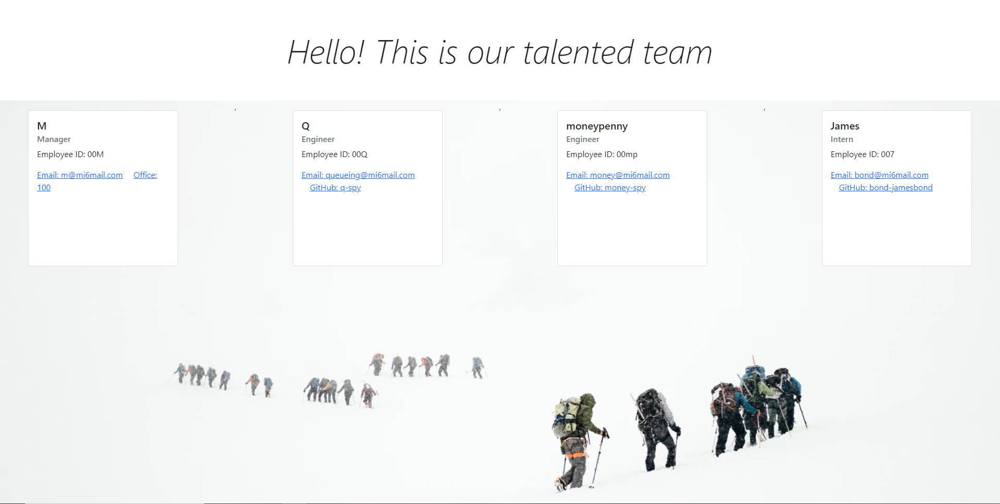

# <Team-Webpage-Generator>

## Description

This Node.js application is run from the command-line. It will generate an HTML webpage for a software engineering team, based on the user input. The HTML webpage will display summaries for each member of the team. The summaries will include email and GitHub profiles info, name, ID and office number, etc.

Communication is an essential part of teamwork. Having an efficient way to accurately reach the right person at the right time can help projects run more smoothly. This application allows for other teams to have an easy way to reach the right member of the team, depending on their needs.

This application will help me practice promises, template literals and testing.

## Table of Contents
- [<Team-Webpage-Generator>](#team-webpage-generator)
  - [Description](#description)
  - [Table of Contents](#table-of-contents)
  - [Installation](#installation)
  - [Usage](#usage)
  - [Credits](#credits)
  - [GitHub](#github)
  - [Features](#features)
  - [Tests](#tests)

## Installation

Go to the GitHub repo,
Fork the repo,
Open the CLI,
Follow the instructions on the #Usage section of this README.

## Usage

This application is run from the command line.
It is initialized using command node index.js
a series of prompts will follow, asking for your input.
Answer accordingly and a index.html file will be output to the same folder of the index.js.

For running the tests see the #Tests section of this README.

For more usage instructions, check this [walkthrough video](https://watch.screencastify.com/v/1M5CZIlGvELeJU9eEU3q)

## Credits

- [Node.js](https://nodejs.dev/learn)
- [File System](https://nodejs.org/api/fs.html)
- [npm](https://www.npmjs.com/)
- [Inquirer](https://www.npmjs.com/package/inquirer)
- [Jest](https://jestjs.io/)

## GitHub

https://github.com/aj-pena/Team-Webpage-Generator.git

## Features

- Node.js 
- File System 
- npm 
- Inquirer 
- Jest 
- HTML 
- CSS 
- JavaScript 

## Tests
Route: Assets/Tests

Test files:
content.test.js
index.test.js

How to run them:
In the CLI,
cd into root folder (Team-Webpage-Generator),
run 'npm run test'.

test for content.test.js should pass.
test for index.test.js should pass but is not working. It is returning an error.
